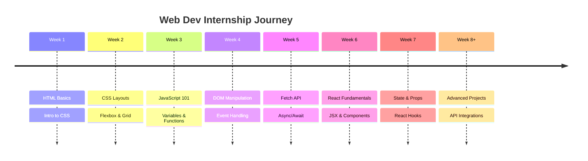

<div align="center">
  
</div>

<p align="center">
  
</p>

<p align="center">
  <a href="#-about"></a>
  <a href="#-tech-stack"></a>
  <a href="#-projects"></a>
  <a href="#-learning-timeline"></a>
  <a href="#-progress"></a>
</p>

<br/>

---

## 📖 About

<div align="center">
  <table>
    <tr>
      <td width="50%">
        <p align="center">
          
        </p>
      </td>
      <td width="50%">
        <p align="left">
          <b>Hey there! 👋</b><br/><br/>
          This repository contains <b>all my daily work</b> completed during my <b>Web Development Internship</b>. It's a journal of my transformation from a beginner to a confident web developer.<br/><br/>
          Each folder represents a stepping stone in my learning journey — from simple HTML pages to full-fledged React applications.
        </p>
      </td>
    </tr>
  </table>
</div>

<br/>

### 📦 What's Inside

<div align="center">
  <table>
    <tr>
      <td align="center" width="100">🌏<br/><b>30+</b><br/>Daily Assignments</td>
      <td align="center" width="100">💻<br/><b>20+</b><br/>Coding Exercises</td>
      <td align="center" width="100">🌐<br/><b>15+</b><br/>Web Applications</td>
      <td align="center" width="100">⚙️<br/><b>8+</b><br/>React Projects</td>
      <td align="center" width="100">🎨<br/><b>25+</b><br/>HTML & CSS Designs</td>
    </tr>
  </table>
</div>

<br/>

---

## 🔧 Tech Stack

<div align="center">

### 🗄️ Core Technologies


### ⚡ Tools & Frameworks


### 🎨 Design


</div>

<br/>

---

## 📂 Repository Structure

```text
📦 WEB-DEV-INTERNSHIP
 ┣ 📁 Week 1           → HTML Basics & Intro to CSS
 ┣ 📁 Week 2           → CSS Layouts & Flexbox
 ┣ 📁 Week 3           → JavaScript Fundamentals
 ┣ 📁 Week 4           → DOM Manipulation & Events
 ┣ 📁 Week 5           → Advanced JS & APIs
 ┣ 📁 Week 6           → React Basics
 ┣ 📁 Week 7           → React Components & State
 ┣ 📁 React-App        → Main React Application
 ┣ 📁 todo-list-app    → To-Do List App
 ┣ 📁 star-rating-widget → Star Rating Component
 ┣ 📁 business-card-app  → Digital Business Card
 ┣ 📁 follow-button-app  → Follow Button Component
 ┣ 📁 personality-quiz   → Personality Quiz
 ┗ 📁 ...and more
```

<br/>

---

## 🚀 Projects Showcase

<div align="center">

| Project | Description | Tech | Status |
|:-------:|:------------|:----:|:------:|
| 🌎 **Country Explorer** | Explore countries with live data | `React` `API` | ✅ Complete |
| 🧮 **Calculator** | Fully functional calculator | `HTML` `CSS` `JS` | ✅ Complete |
| 🕐 **Digital Clock** | Real-time digital clock | `HTML` `CSS` `JS` | ✅ Complete |
| 📋 **To-Do List** | Task management app | `React` | ✅ Complete |
| 📊 **Student Dashboard** | Data visualization dashboard | `React` `CSS` | ✅ Complete |
| 📄 **Responsive Pages** | Mobile-first layouts | `HTML` `CSS` | ✅ Complete |
| 🖥️ **User Dashboard** | React user management | `React` | ✅ Complete |
| 🔗 **API Integration** | Fetch & display API data | `JS` `API` | ✅ Complete |

</div>

<br/>

---

## 📅 Learning Timeline

<div align="center">



</div>

<br/>

---

## 📈 Skill Progress

<div align="center">

<table>
  <tr>
    <td width="200"><b>📄 HTML5</b></td>
    <td width="400">
      <div style="background-color:#e0e0e0;border-radius:10px;overflow:hidden">
        <div style="width:95%;height:24px;background:linear-gradient(90deg,#FF6B6B,#ee5a24);border-radius:10px;display:flex;align-items:center;justify-content:center;color:white;font-weight:bold;font-size:13px">95%</div>
      </div>
    </td>
  </tr>
  <tr>
    <td><b>🎨 CSS3</b></td>
    <td>
      <div style="background-color:#e0e0e0;border-radius:10px;overflow:hidden">
        <div style="width:90%;height:24px;background:linear-gradient(90deg,#00C9FF,#0072ff);border-radius:10px;display:flex;align-items:center;justify-content:center;color:white;font-weight:bold;font-size:13px">90%</div>
      </div>
    </td>
  </tr>
  <tr>
    <td><b>⚡ JavaScript</b></td>
    <td>
      <div style="background-color:#e0e0e0;border-radius:10px;overflow:hidden">
        <div style="width:85%;height:24px;background:linear-gradient(90deg,#FFD93D,#f0932b);border-radius:10px;display:flex;align-items:center;justify-content:center;color:#333;font-weight:bold;font-size:13px">85%</div>
      </div>
    </td>
  </tr>
  <tr>
    <td><b>⚛️ React.js</b></td>
    <td>
      <div style="background-color:#e0e0e0;border-radius:10px;overflow:hidden">
        <div style="width:75%;height:24px;background:linear-gradient(90deg,#61DAFB,#3498db);border-radius:10px;display:flex;align-items:center;justify-content:center;color:white;font-weight:bold;font-size:13px">75%</div>
      </div>
    </td>
  </tr>
  <tr>
    <td><b>🔗 REST APIs</b></td>
    <td>
      <div style="background-color:#e0e0e0;border-radius:10px;overflow:hidden">
        <div style="width:80%;height:24px;background:linear-gradient(90deg,#6BCB77,#27ae60);border-radius:10px;display:flex;align-items:center;justify-content:center;color:white;font-weight:bold;font-size:13px">80%</div>
      </div>
    </td>
  </tr>
  <tr>
    <td><b>📱 Responsive Design</b></td>
    <td>
      <div style="background-color:#e0e0e0;border-radius:10px;overflow:hidden">
        <div style="width:90%;height:24px;background:linear-gradient(90deg,#92FE9D,#00b894);border-radius:10px;display:flex;align-items:center;justify-content:center;color:white;font-weight:bold;font-size:13px">90%</div>
      </div>
    </td>
  </tr>
  <tr>
    <td><b>🐙 Git & GitHub</b></td>
    <td>
      <div style="background-color:#e0e0e0;border-radius:10px;overflow:hidden">
        <div style="width:85%;height:24px;background:linear-gradient(90deg,#764ABC,#6c5ce7);border-radius:10px;display:flex;align-items:center;justify-content:center;color:white;font-weight:bold;font-size:13px">85%</div>
      </div>
    </td>
  </tr>
  <tr>
    <td><b>🧩 Problem Solving</b></td>
    <td>
      <div style="background-color:#e0e0e0;border-radius:10px;overflow:hidden">
        <div style="width:80%;height:24px;background:linear-gradient(90deg,#FF8C00,#e17055);border-radius:10px;display:flex;align-items:center;justify-content:center;color:white;font-weight:bold;font-size:13px">80%</div>
      </div>
    </td>
  </tr>
</table>

</div>

<br/>

---

## 🎯 Objectives

<details>
<summary><b>🎯 Click to expand</b></summary>

<br/>

| # | Objective | Status | Icon |
|:-:|:----------|:------:|:----:|
| 1 | Improve Frontend Development Skills | ✅ Achieved | 💪 |
| 2 | Learn Modern JavaScript (ES6+) | ✅ Achieved | ✨ |
| 3 | Build React Applications | ✅ Achieved | ⚛️ |
| 4 | Work with REST APIs | ✅ Achieved | 🌐 |
| 5 | Practice Responsive Web Design | ✅ Achieved | 📱 |
| 6 | Understand Git & GitHub Workflow | ✅ Achieved | 🐙 |
| 7 | Deploy Projects to Production | 🚧 In Progress | 🚀 |
| 8 | Learn TypeScript | 🔜 Next Up | 📘 |

</details>

<br/>

---

## ✅ Achievements

<div align="center">

| Achievement | Date |
|:------------|:----:|
| 🎉 Completed HTML & CSS Fundamentals | Week 1 |
| 🎉 Built First Responsive Website | Week 2 |
| 🎉 Mastered JavaScript Basics | Week 3 |
| 🎉 DOM Manipulation Projects Done | Week 4 |
| 🎉 First API Integration | Week 5 |
| 🎉 First React App Built | Week 6 |
| 🎉 State Management with Hooks | Week 7 |
| 🎉 Full-Stack Mini Projects | Week 8+ |

</div>

<br/>

---

## 👨‍💻 Author

<div align="center">
  
  
  <h2>👋 Atharv Pote</h2>
  
  <p><b>Passionate Web Developer</b></p>
  
  <p>
    <a href="mailto:atharvpote@email.com"></a>
    <a href="https://www.linkedin.com/in/atharvpote"></a>
    <a href="https://github.com/atharvpote"></a>
    <a href="https://twitter.com/atharvpote"></a>
  </p>
  
  <br/>
  
  <details>
    <summary><b>📊 GitHub Stats</b></summary>
    
    <br/>
    
    <br/>
    
    
  </details>
  
</div>

<br/>

---

<div align="center">
  
</div>

<div align="center">
  
  ### ⭐ If you like this repository, don't forget to Star it!
  
  <sub>Last Updated: July 2026</sub>
  
</div>
